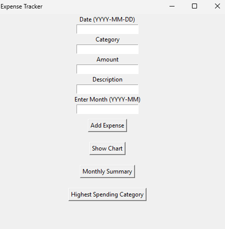
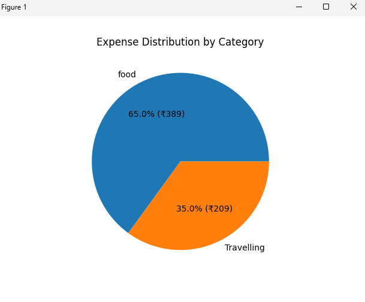
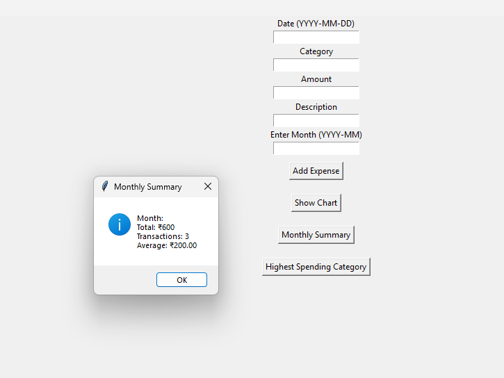

# Expense Tracker (Python)

## Overview

This project is a simple Expense Tracker developed using Python. It allows users to record daily expenses, store them in a CSV file, and analyze spending patterns.

## Features

* Add daily expenses with date, category, amount, and description
* Store data in a CSV file
* View expense records
* Category-wise expense analysis using pie chart
* Identify highest spending category
* Generate monthly summaries

## Technologies Used

* Python
* Tkinter (for GUI)
* CSV (for data storage)
* Matplotlib (for charts)

## How to Run

1. Install Python
2. Install required libraries:
   pip install matplotlib
3. Run the program:
   python main.py

## Screenshots

Main Interface

Pie Chart Analysis

Monthly Summary

## Outcome
This tool helps users track their expenses and understand where their money is being spent. It also provides simple visual insights for better financial management.
